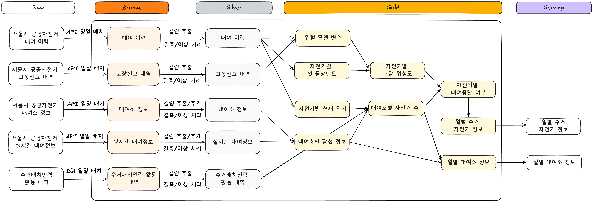

# 고장 위험도 기반 공공자전거 수거 목록 제공 시스템

따릉이 : 9와4분의3 대여소에서 너를 기다려 (WaitForDdaman)

## 개요

서울시 공공자전거 따릉이의 대여이력, 고장 신고 및 대여소 데이터를 활용하여 고장 위험이 높은 자전거를 선별하는 데이터 파이프라인 및 운영 대시보드이다.

자전거별 고장 위험도와 대여소별 재고 상태를 반영한 **수거 권장 목록**을 산출하고, 정비소의 일일 수용력을 반영한 **최종 수거 목록**을 제공한다.

## 문제 정의

**누구의**

- **수거 반장**: 한정된 인력과 정비소 수용력을 고려하여 당일 수거량을 결정해야 하는 사람
- **현장 작업자**: 수거 및 배치 지시에 따라 현장 작업을 수행하는 사람

**문제 (Pain Point)**

> 어떤 자전거를 먼저 수거해야 하는지 판단할 수 있는 데이터가 없다.

**해결책**

> 자전거별 **고장 위험도**와 **대여소 재고 상태**를 산출하고, **정비소의 일일 수용력**을 반영한 **수거 목록**을 제공한다. 수거 가능 대수를 초과한 고위험 자전거는 대여 중단 대상으로 분류하여 이용자의 고장 노출을 줄인다.

**행동**

> **수거 반장**은 매일 업무 시작 전에 (파이프라인이 제공하는) **수거 권장 목록**을 확인하고, (대시보드에서) 당일 정비소가 수용할 수 있는 양을 조절하여 **최종 수거 목록**을 만들어서 **현장 작업자**에게 전달한다.

**메인지표**

신규 고장 선제 포착률

> 직전 30일 동안 고장 신고가 없었던 신규 고장 자전거 중, 실제 신고가 접수되기 전에 당일 정비소 수용력 범위의 수거 우선순위 목록에 포함된 자전거의 비율
>
> 2026년 7월 한 달 동안 **신규 고장 선제 포착률 Before 0% → After XX%**

### 기대 효과와 측정 지표

| 관점 | Before | After | 측정 지표 |
| --- | --- | --- | --- |
| 수거 대상 결정 | 여러 원천을 개별적으로 확인 | 위험도순 자전거 목록과 위치를 함께 제공 | 수거 대상 선정 시간 |
| 고장 대응 | 고장 신고 이후 사후 대응 | 고장 가능성이 높은 자전거를 사전에 선별 | `capture@K`, 수거 적중률 |
| 데이터 제공 | 원천별 수동 확인과 시점 불일치 | 동일 기준일의 일별 Mart와 Serving 데이터 제공 | 업무 시작 전 제공률, 데이터 최신성 |
| 장애 대응 | 전체 작업을 처음부터 재실행 | 실패 Task 재실행 및 누락 구간 Catch-up | 평균 복구 시간, 재실행 성공률 |
| 처리 성능 | 반복적인 엔진 기동과 중간 S3 I/O | 작업 특성별 엔진 선택과 증분 처리 | 실행시간, 스캔 파티션 수 |

**검증된 처리 성능 개선 사례**

- 고장 신고 Silver 변환: **50.5초 → 13.4초**, 약 **3.8배 개선**
- 원인: 5개 Task에서 반복되던 세션 기동과 중간 S3 읽기·쓰기를 단일 Task로 통합

## 결과

- 우리의 산출물
    - 수거 권장 목록

      

    - 수거 확정 목록

      

- 사이트: http://ec2-15-165-230-137.ap-northeast-2.compute.amazonaws.com/

## 구성

### 데이터 흐름도 / 메달리온 아키텍처

| 계층 | 책임 |
| --- | --- |
| Raw·Bronze | API 응답과 입력 파일 보존, 수집 시점과 Lineage 관리 |
| Silver | 타입·스키마 표준화, 중복·NULL·비정상 값 처리 |
| Gold | 자전거 위치, 대여소 재고, 모델 피처, 위험도와 의사결정 생성 |
| Mart | 서비스가 바로 조회할 수 있는 일별 자전거·대여소 데이터 구성 |
| Serving | PostgreSQL 적재, API 계약 제공 및 적재 결과 검증 |

### 인프라 아키텍처

## 우리의 고민정리 / 고려한 사항

저희의 데이터 파이프라인을 구성할 때 고려한 사항은 다음과 같습니다.

### 1. 업무 시작 전에 정보를 전달

- 최종 수집 실패 시 검증된 당일 예비 데이터를 사용하여 일별 산출물 생성의 연속성 확보
- 장애 감지 및 신속한 대응
    - Lambda 오류와 DLQ 메시지를 CloudWatch Alarm으로 감지하고 SNS로 전달
    - Airflow Task 실패 시 Slack 알림
    - 실패 범위를 Task 단위로 격리하여 해당 작업부터 재실행
    - CloudWatch 기반 파이프라인 모니터링 및 Slack 장애 알림

### 2. 믿고 사용할 수 있는 정보를 전달

- 데이터 시점 및 변경 이력 관리
    - Iceberg의 파티션 단위 원자적 overwrite로 쓰기 일관성 확보 및 Snapshot 기반 중복 제거를 통한 시점 관리
    - 과거 Snapshot 조회와 롤백을 통한 데이터 재현 및 장애 복구 지원
- 데이터 누락 및 공백 대응
    - PythonSensor를 통한 Watermark와 Snapshot 검증
    - Watermark로 미처리 구간 관리와 Catch-up 처리로 누락된 구간 보완
    - Initial Load로 과거 데이터를 구축하고 Cold Start 문제 해결
- 데이터 품질 검증
    - 메달리온 아키텍처 단계별 SQL Assertion으로 필수값, 중복, 값의 범위 및 키 정합성 검증
- 고장 신고 내역을 포함한 ML 기반 위험도 예측 및 대여중단 의사결정 파이프라인

### 3. 데이터가 증가해도 제시간에 처리

- 작업 특성에 따른 처리 엔진 선택
    - 초기에 대용량 파일 적재 시 Spark 사용
    - 일별 정형 변환에는 DuckDB, PyArrow, PyIceberg를 사용하여 Spark JVM 기동 비용 절감
- 처리 범위 및 병렬 실행 최적화
    - 날짜 파티셔닝과 Watermark 기반 증분 처리로 전체 이력 재스캔 방지
    - Initial Load 파일을 Dynamic Task Mapping으로 분리하여 병렬 처리 및 실패 범위 격리
    - 시간대 내부 페이지네이션은 순차 처리하고 결과는 시간순으로 결합하여 결정성 보장
- Iceberg 저장소 유지보수
    - Small file 병합, 보존 기간 지난 Snapshot 만료, 고아 파일 정리를 통해 조회 효율과 저장 공간을 관리
    - 일 배치와 유지보수 DAG를 분리하여 유지보수 실패가 일별 산출물 제공에 미치는 영향 차단

## 기술 스택

| 영역 | 기술 | 선택 이유 |
| --- | --- | --- |
| Orchestration | Airflow | 일별 스케줄, Asset·Sensor 의존성, 재시도와 Task 단위 재실행 |
| Distributed Processing | Spark | 대용량 초기 적재와 모델 피처 집계 |
| In-process Analytics | DuckDB | 일별 SQL 변환, Window Function과 조인을 낮은 기동 비용으로 처리 |
| Data Interface | PyArrow | DuckDB와 Iceberg 사이의 컬럼형 데이터 전달 |
| Data Lakehouse | S3, Apache Iceberg, PyIceberg | 파티셔닝, 원자적 커밋, Snapshot, 재처리와 변경 이력 관리 |
| ML | scikit-learn, LightGBM | 규칙·선형·트리 모델 비교와 Champion 관리 |
| Serving | PostgreSQL, FastAPI | 일별 Mart 적재와 읽기 전용 API 제공 |
| Frontend | React, TypeScript | 지도, 위험 자전거 목록과 수거 확정 화면 제공 |
| Infrastructure | AWS Lambda, EC2, RDS, ECR | Raw 수집, 실행 환경, 서빙 DB와 이미지 배포 |
| Monitoring | CloudWatch, SNS, Slack | Lambda·DLQ 감지와 Airflow 실패 알림 |
| IaC·CI/CD | Terraform, GitHub Actions, Docker | 인프라 재현과 이미지 기반 배포 자동화 |
| Local Development | Docker Compose, LocalStack | AWS 자원을 로컬에서 재현하고 E2E 검증 |

## 한계 및 향후 작업

- 현재 모델 평가는 제한적인 로컬 데이터와 짧은 홀드아웃 구간에서 수행되어 장기간 운영 데이터 기반 재평가가 필요합니다.
- 위험 등급 임계값은 모델과 데이터 분포 변화에 따라 다시 검증해야 합니다.
- 업무 시작 전 제공을 위한 운영 SLA와 전체 End-to-End 실행시간을 실제 운영 환경에서 확정해야 합니다.
- Slack 실패 알림은 현재 일부 주요 DAG에만 적용되어 전체 파이프라인으로 확대할 필요가 있습니다.
- 실제 수거 결과가 축적되면 신규 고장 선제 포착률 및 수거 적중률, 고장 감소율과 작업시간 절감 효과를 측정해야 합니다.
- 데이터 규모 증가에 따라 실행 시간, 메모리, 파일 크기와 저장 비용을 지속적으로 관찰해야 합니다.
- 작업자별 업무 배정, 완료 상태, 사용자 인증과 이동 경로 최적화는 향후 서비스 확장 영역입니다.

## 팀원 소개

<table align="center">
<tr>
<td align="center"><a href="https://github.com/ddcdi"><b>이관형</b></a></td>
<td align="center"><a href="https://github.com/ezzkimm"><b>김은정</b></a></td>
<td align="center"><a href="https://github.com/minsuh99"><b>박민서</b></a></td>
<td align="center"><a href="https://github.com/juri-lee54"><b>이주리</b></a></td>
</tr>
<tr>
<td align="center"></td>
<td align="center"></td>
<td align="center"></td>
<td align="center"></td>
</tr>
<tr>
<td align="center"><b>DE</b></td>
<td align="center"><b>DE</b></td>
<td align="center"><b>DE</b></td>
<td align="center"><b>DE</b></td>
</tr>
</table>
